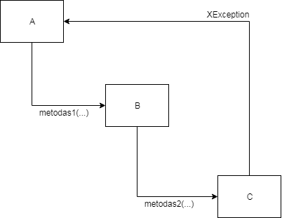

## Užduotys: *Exceptions*

## Nr. 1

### Užduotis



Klasėje `A` yra kviečiamas klasės `B` metodas. Klasėje `B` yra kviečiamas klasės `C` metodas. Klasės `C` metodas iššaukia klaidą. Šią klaidą reikia apdoroti klasėje `A`.

## Nr. 2

### Užduotis

1. Sukurkite klasę `Input`. Klasė turi metodą, kurį iškvietus programa vartotojo paprašo įvesti sveikąjį skaičių ir metodas įvestą skaičių grąžina.
2. Kitoje klasėje metode `main` iškvieskite klasės `Input` metodą.
3. Įvestą skaičių atspausdinkite.
4. Paleiskite programą ir įveskite skaičių su slankuoju kableliu. gausite klaidą.
5. Apsaugokite programą nuo 'nulūžimo' - įvedus ne sveikąjį skaičių programa turi pranešti, kad įvesti netinkami duomenys ir prašys įvesti skaičių dar kartą. Programa prašys įvesti skaičių tol kol jį vartotojas įves teisingai.

## Nr. 3

### Užduotis

1. Sukurkite klasę `Device`. Klasė turi klasės kintamuosius - `isOn`, kuris reiškia ar įrenginys yra įjungtas, ir `id`, kuris yra unikalus įrenginio numeris (nustatomas sukuriant objektą).
2. Sukurkite keletą įrenginių, kurie paveldės `Device` klasę.
3. Sukurkite *exception* klasę `DeviceIsOffException`.
4. Klasėje `Device` sukurkite metodą 'ping', kuris patikrina ar įrenginys yra įjungtas. Jei įrenginys išjungtas, turi būti sukelta išimtis 'DeviceIsOffException'.
5. Sukurti klasę `Monitoring` su metodu `pingAllDevices`, kuris priima sąrašą įrenginių ir juos tikrina kviesdamas `ping` metodą tikrina ar įrenginys yra įjungtas. Patikrinimo rezultatą išveda į ekraną.
6. Atskiroje klasėje su `main` metodu sukurkite keletą įrenginių ir juos *monitorinkite*. Tada vieną iš įrenginių išjunkite ir vėl *monitorinkite*.

Tokios veiksmų sekos
```java
public static void main(String[] args) {

    Monitoring monitoring = new Monitoring();

    List<Device> devices = new ArrayList<>();
    devices.add(new Mouse(true));
    devices.add(new Display(true));
    devices.add(new Keyboard(true));
    devices.add(new Mouse(true));
    devices.add(new Display(true));
    devices.add(new Keyboard(true));

    monitoring.pingAllDevices(devices);
    devices.get(3).setOn(false);
    monitoring.pingAllDevices(devices);
}
```
rezultatas galėtų būti toks:
```
-----Pinging started-----
Device Mouse with id 0 is ON
Device Display with id 1 is ON
Device Keyboard with id 2 is ON
Device Mouse with id 3 is ON
Device Display with id 4 is ON
Device Keyboard with id 5 is ON
-----Pinging finished----

-----Pinging started-----
Device Mouse with id 0 is ON
Device Display with id 1 is ON
Device Keyboard with id 2 is ON
Device Mouse with id 3 is OFF.
Device Display with id 4 is ON
Device Keyboard with id 5 is ON
-----Pinging finished----
```